<h1 align="center">Skails Map Viewer</h1>

Skails Map Viewer is an All-In-One app that provides **full-screen easy-to-switch topo maps** from various providers, and key features to plan and drive any outdoor activities in the world (Hiking, Trail Running, Ski Touring, Alpinism,...) 

It can be installed from here 

It has been developed from [osmdroid demo project](https://github.com/osmdroid/osmdroid)

# Overall Presentation

- The main screen is a simple full-screen map interface

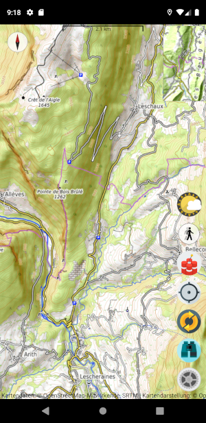

- Different map sources can be selected to be easily displayed in the main map

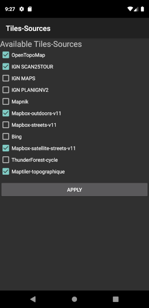

- An auto-completed location search function permits to center the main map everywhere in the world

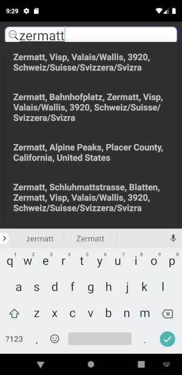

  

# Main Screen Buttons

The main screen of the app is a full-screen map with:
- Minimap that provides an overall situation of the displayed scene
- A compas
- Some buttons that permit to easily control the map and add some overlays

Here is a description of those buttons:

| Icon                                                  | Signification |
|-------------------------------------------------------|---------------|
|  | Access the app Main menu (including the Tiles Sources list selection)|
|  | Search for a location to center the map on|
|  | Change the Map source: 1 press switch to the next Tile Source in the configuration list |
|  | Center the map on the current location (Need location persmission to be granted |
|  | Display slopes inclination overlay on top of main map (<b>FRANCE ONLY</b>). Successive presses on the button increase the contrast of the overlay |
|  | Activate Follow-Me service. Your moves are recorded and displayed on the Main Map. Works as a ForeGround service (with notification in the icons tray to control it) |
|  | Display Weather information as overlays of Main Map. Successive press switch the overlay type: pressure, precipitations, temperature |

  

# Map Tiles Sources

Different Map Tiles Sources are accessible via the application. Please refer to the Tiles Source warning

| Tile Source            | Screenshot | Usage |
|------------------------|------------|-------|
|Map | |CC-BY-SA licence |
|IGN Scan25Tour |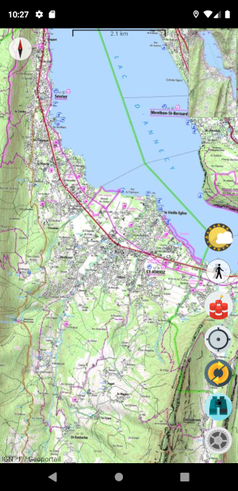 |NOT FREE (<b>May stop working at any time</b>) |
|IGN Maps |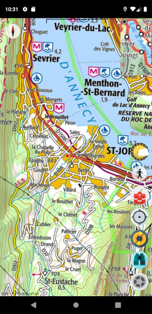 |NOT FREE (<b>May stop working at any time</b>) |
|IGN PLAN v2 |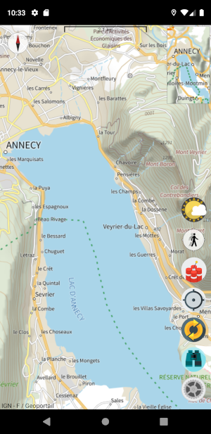 |NOT FREE (<b>May stop working at any time</b>) |
|OpenStreetMap (Mapnik) | |Open Data Commons Open Database License (ODbL) by the OpenStreetMap Foundation (OSMF) |
|Mapbox Outdoors  |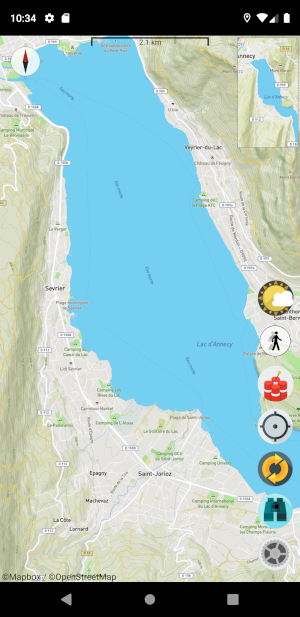 |NOT FREE (<b>May stop working at any time</b>) |
|Mapbox Streets |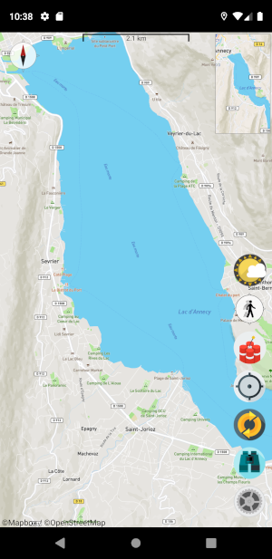 |NOT FREE (<b>May stop working at any time</b>) |
|Bing Maps |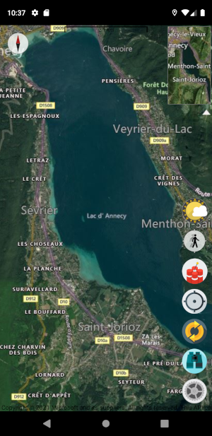 |NOT FREE (<b>May stop working at any time</b>) |
|Mapbox Satellite (with streets)|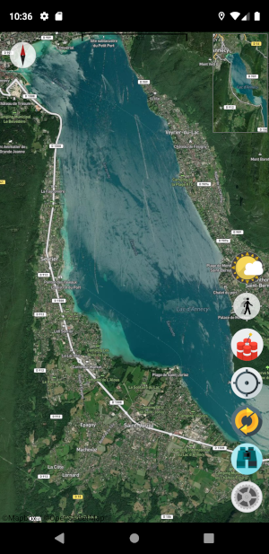 |NOT FREE (<b>May stop working at any time</b>) |
|Thunderforest Cycle |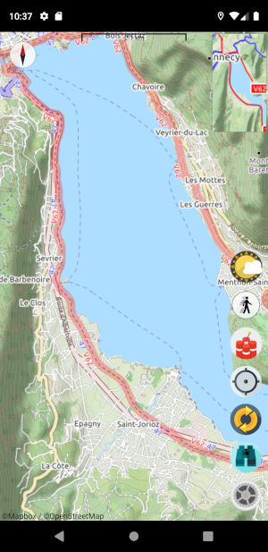 |NOT FREE (<b>May stop working at any time</b>) |
|MapTiler Topographic |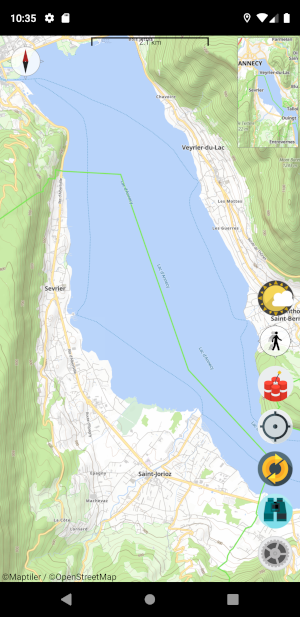 |NOT FREE (<b>May stop working at any time</b>) |

  

# Slope Inclination Overlay (FOR FRANCE ONLY)

When clicking the  button, the Slopes Inclination overlay displays on top of Main Map. When pressing the button several times, the contrast of the overlay increases

| 1 Press | 2 Presses | 3 Presses |
|---------|-----------|-----------|
|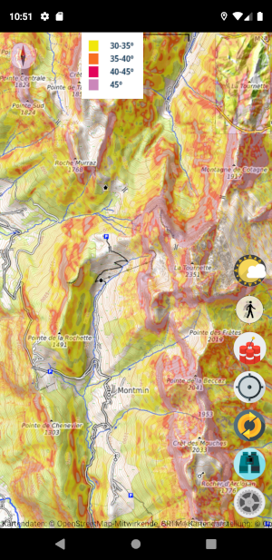 | 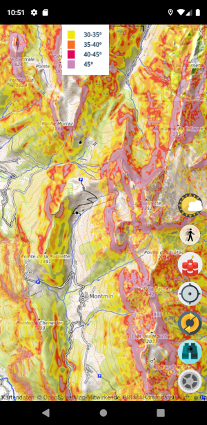 | 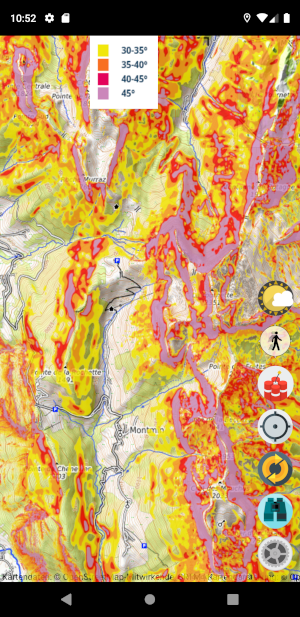 |

  

# Weather Overlay

When clicking the  button, some Weather information overlay displays on top of Main Map. When pressing the button several times, different weather information appears

| 1 Press: Temperatures | 2 Presses: Pressions | 3 Presses: Precipitations |
|---------|-----------|-----------|
|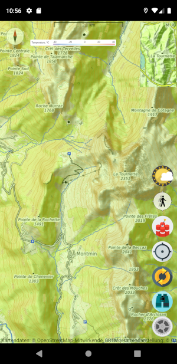 | 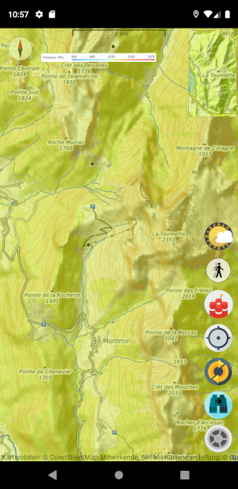 | 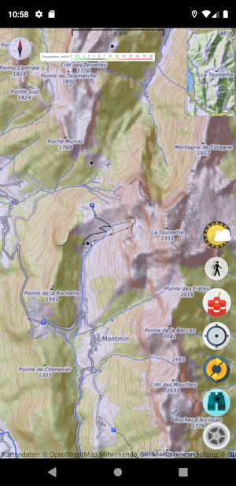 |

  

# Follow Me Service

When clicking the  button, the Follow-Me Service starts. Then:
- The Button changes for   indicating that the service is running
- Notifcation appears in the icon tray
- Red lines is displayed to follow your position updates

 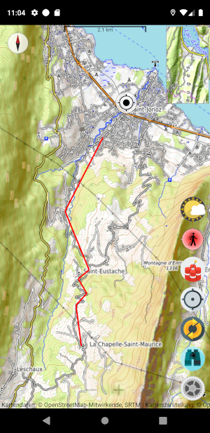
 

- To stop the Follow-Me service, press again on the  button. It then switches back to  
- To reset the Follow-Me service, long-press on the  button

  

# Itinary Service

- When long-pressing anywhere on the map, a  icon appears. It marks the start of an itinary computation
- When pressing anywhere on the map, a  icon appears that mark a waypoint on the itinary computation
- When long-pression again, a  icon appears. It marks the end of the itinary computation. Then Itinary Proposal including itinary information (Distance, walking duration, Elevation) displays

 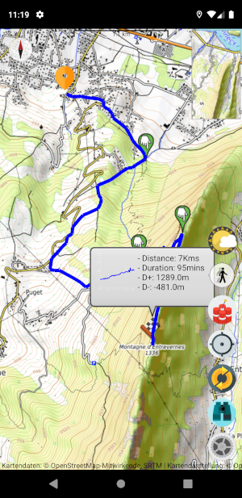
 

# BERA display
######For France only: Bulletin d'Estimations des Risques d'Avalanche

- When pressing anywhere on the map, IF EXISTS, the BERA of the massif you touch displayed in full-screen

 
 
